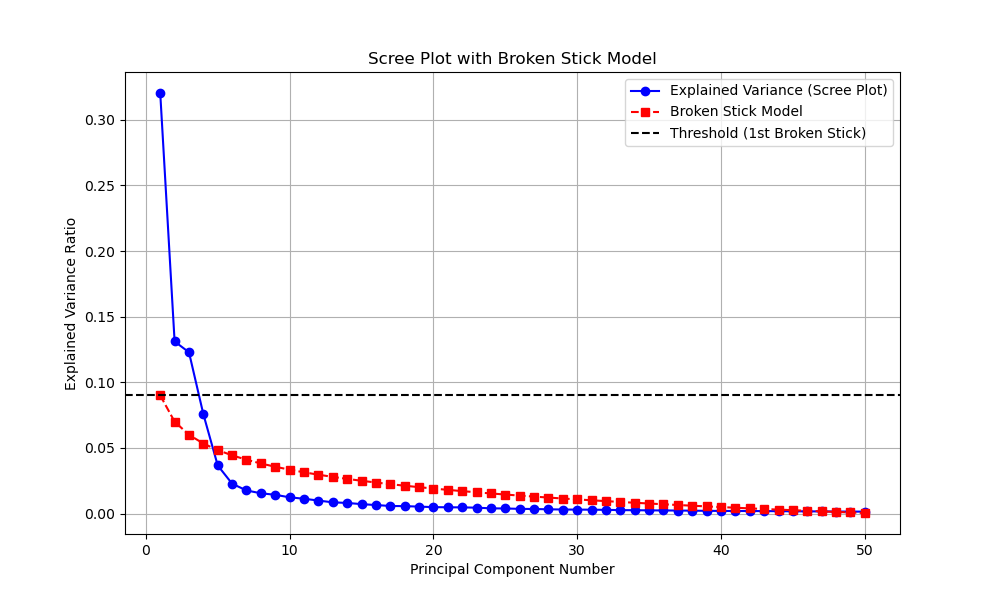
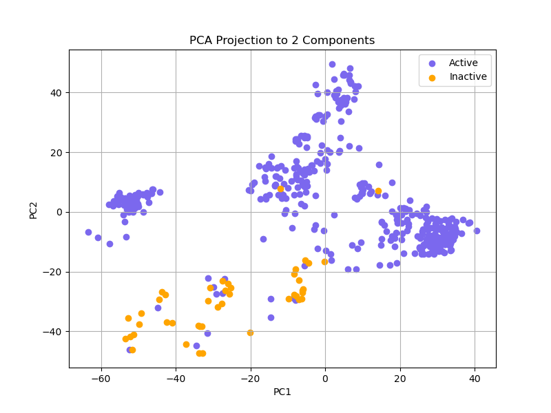
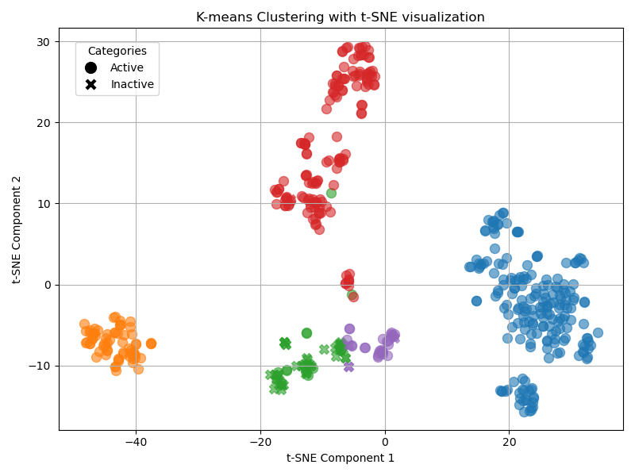
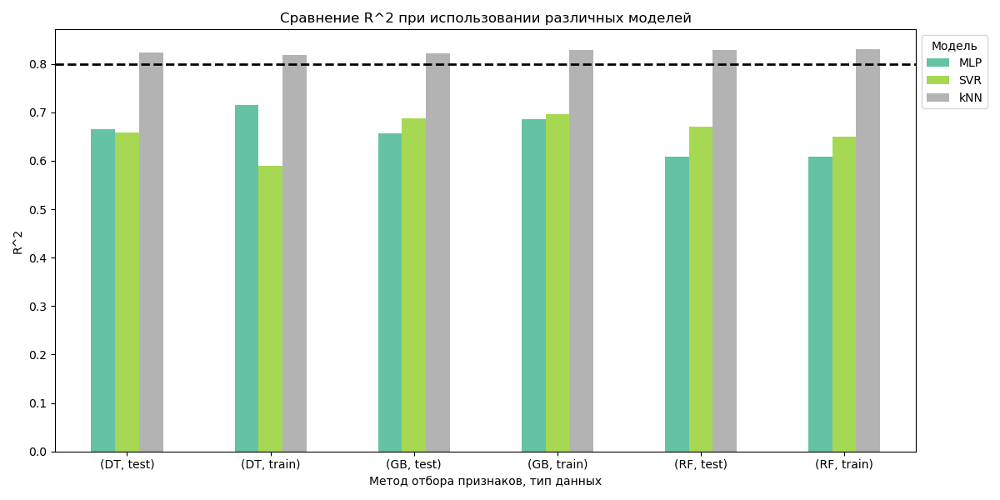
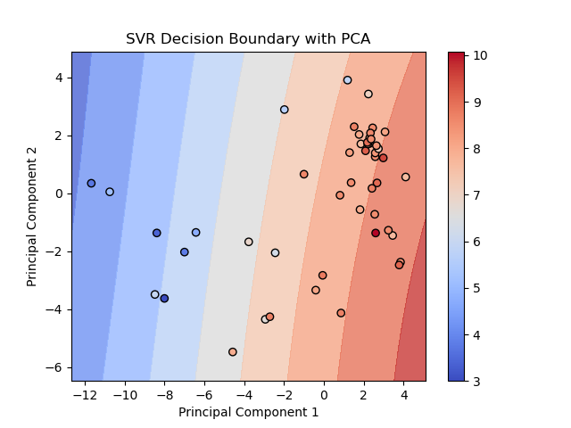
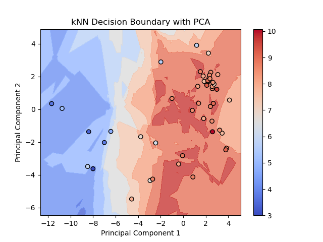
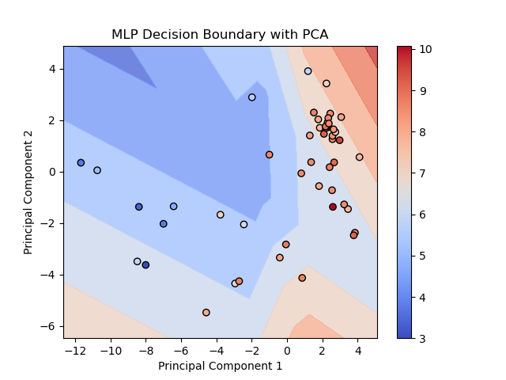
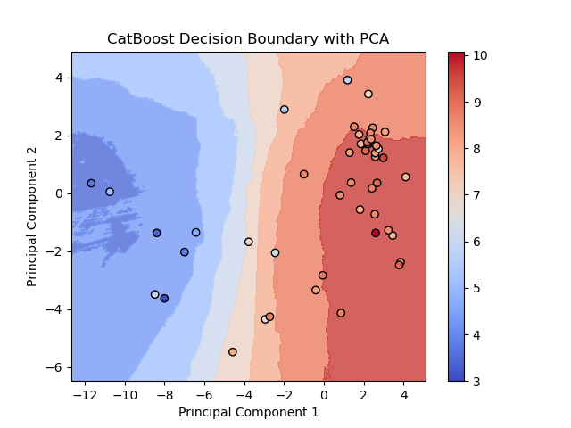
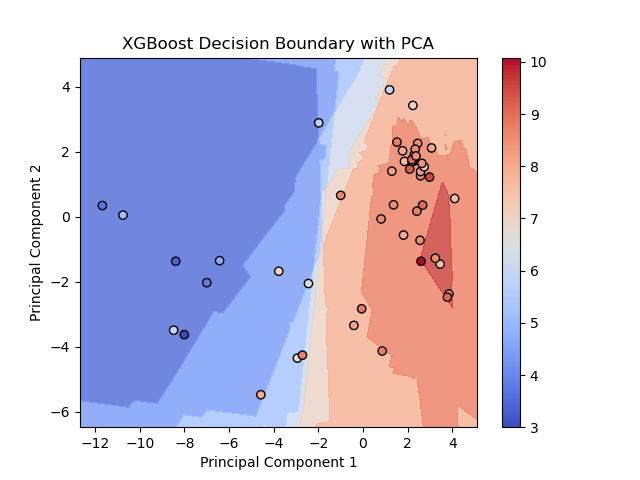
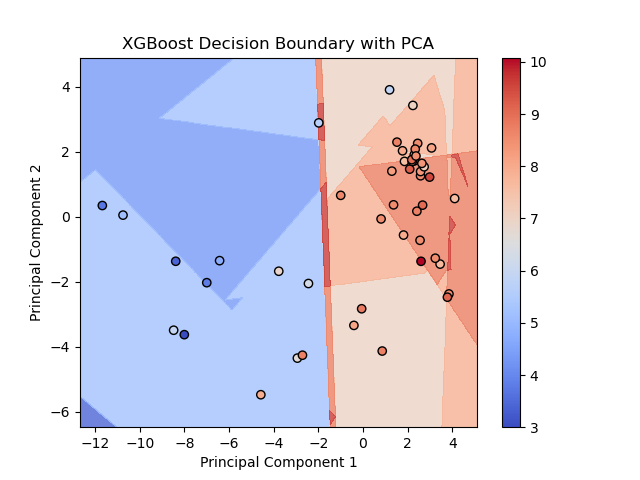

# ML models for targeting NS3/4A of HCV

A project on building a QSAR model for predicting the activity of chemical compounds against NS3/4A - a non-structural protein of the Hepatitis C virus. The Hepatitis C virus is a pathogenic virus that poses a threat to human health worldwide. A model for predicting the activity of a molecule based on its structure can help in the development of new therapy for Hepatitis C targeting the NS3/4A protein.
The obtained result on the test set: **Test R2 = 0.8358**

## Contents

1. [Project Structure](#project-structure)
2. [Data Preprocessing](#data-preprocessing)
3. [Data Visualization](#data-visualization)
4. [Selection of Machine Learning Methods](#selection-of-machine-learning-methods)

## Project Structure

```bash
├── feature_selection.ipynb
├── model_DT.ipynb
├── model_GB.ipynb
├── model_RF.ipynb
├── Plots
│   ├── CatBoost_Decision_Boundary.png
│   ├── k-means_with_t-SNE_visualization.png
│   ├── kNN_Decision_Boundary.png
│   ├── MLP_Decision_Boundary.png
│   ├── PCA_projection.png
│   ├── R2_comparison.png
│   ├── Scree_Plot_with_Broken_Stick_Model.png
│   ├── SVR_Decision_Boundary.png
│   ├── XGBoost_Decision_Boundary.png
│   └── XGBoost_with_optuna.png
├── README.md
└── Visualization.ipynb
```

All project code is divided into several notebooks:

* Feature selection in feature_selection.ipynb
* Data visualization in Visualization.ipynb
* Model building using Decision Tree in model_DT.ipynb
* Model building using Random Forest in model_RF.ipynb
* Model building using Gradient Boosting in model_GB.ipynb

## Data Preprocessing:

Experimentally confirmed bioactive compounds for NS3/4A were obtained from the ChEMBL database. The following steps were performed:

1. Collection of chemical compound data against the NS3/4A protein from ChEMBL. 1106 records were obtained.
2. Data filtering: inhibitors with IC50 values and SMILES were selected. Duplicates were then removed. After filtering, 495 unique molecules were obtained
3. The IC50 value (half-maximal inhibitory concentration) was converted to pIC50 using a logarithmic function: pIC50 = -log10(IC50)
4. Chemical structures were converted from SMILES format to 3D-SDF using openbabel version 3.1.0. The resulting file was then used to extract chemical descriptors and fingerprints.
5. The PaDEL-Descriptor program was used to calculate molecular descriptors. A total of 17 968 features were calculated for each molecule. These molecular descriptors and fingerprints reflect information about the molecular structure, such as molecular weight, number of bonds, etc.
6. Since 17 968 features is too large a number of features for 495 molecules, the most important features were selected. Feature selection is necessary to prevent overfitting. Since the number of molecules should be at least 5 times greater than the number of descriptors, the 50 most important features were selected. Feature selection was performed using the SelectFromModel method and different models: Decision Tree, Random Forest, Gradient Boosting. In total, 50 most important features were selected using each of the models.
7. Data normalization. Z-scores were calculated for the features, and molecules where at least one feature had a Z-score greater than 3 were removed (to remove outliers). The features were then divided into binary and numerical. Binary features are fingerprints that do not require scaling. Numerical features were scaled using StandardScaler.

Thus, the target variable is the pIC50 value (regression task). The features are the 50 most important molecular descriptors and fingerprints that were scaled.

## Data Visualization

To find any patterns in the data, data visualization was performed

1. Initially, dimensionality reduction was performed using PCA and a Scree Plot with Broken Stick Model was also plotted. Thus, only the first 4 principal components (PC1–PC4) explain variance that is greater than expected by chance (according to the broken-stick model).



2. The first 2 components were displayed. The molecules were divided into 2 groups: active (pIC50>=5) and inactive(pIC50<5). It can be seen that active and inactive molecules are well separated.



3. Next, clustering was performed using k-means (k=5). Cluster visualization was performed using t-SNE. It can be seen that inactive molecules are mainly located in the green cluster, as well as several compounds in the purple cluster. The remaining active compounds are divided into 3 separate clusters.



## Selection of Machine Learning Methods

Initially, 3 methods were selected for model building: SVR, kNN Regressor, MLP Regressor. Each of the three methods (SVR, kNN, MLP) was applied to each set of selected features (DT, RF, GB). Thus, 9 different models were obtained.

A summary plot comparing the coefficients of determination (R²) for different models was constructed. Since different feature selection methods generally produce similar metrics, it was decided to keep only one model for feature selection - Random Forest - and continue selecting different models for training specifically on this dataset.



Decision boundaries were also constructed for the SVR, kNN, MLP models using the features selected with RF as an example.







Since the data clustered well using k-means, it was initially hypothesized that the kNN Regressor model would perform well in predicting pIC50, which is confirmed by the coefficient of determination.
Thus, the k-nearest neighbors model was selected as the baseline for solving this task: **RMSE = 0.68099, R² = 0.8290.**

In order to improve the metrics obtained with the baseline, it was decided to use gradient boosting methods. However, the CatBoost model gave **R² = 0.7516, XGBoost: R²: 0.7689** on the test data. It is also worth noting that the models were prone to severe overfitting.

Decision boundary for CatBoost:



Decision boundary for XGBoost:



Next, to improve the coefficient of determination and prevent overfitting, it was decided to optimize the R² gap between train and test using the optuna library.

Hyperparameter optimization:

```python
# Penalty for overfitting
gap = r2_train - r2_val
penalty = 20  # Penalty coefficient
score = r2_val - penalty * gap  # Minimize this function
```

Using this approach, the metric obtained with the baseline was improved: **Test R2 = 0.8358**



Two models with different neural network architectures were also built: with FC layers and a transformer, but they did not lead to an improvement in the metrics.
